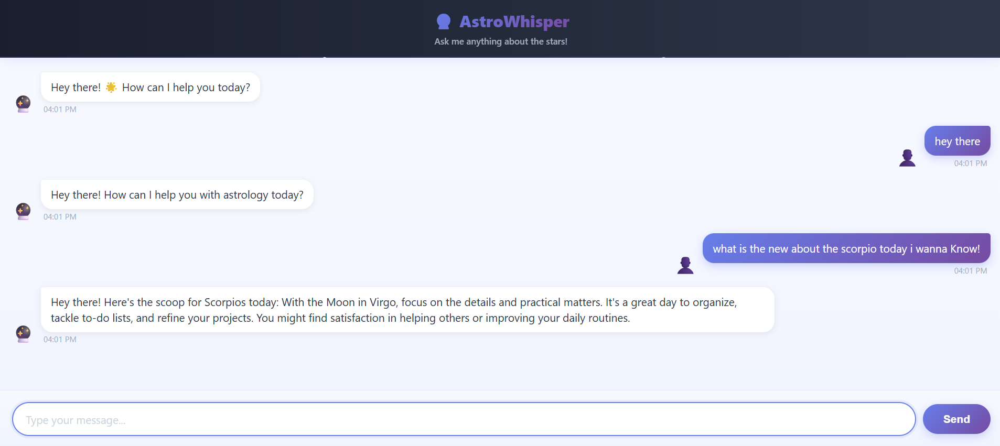

# AstroWhisper Chatbot

AstroWhisper Chatbot is an advanced conversational AI assistant built on Flask to support natural language interactions for astronomy research, educational outreach, and general knowledge purposes. Harnessing cutting-edge machine learning and NLP models, it provides insightful responses, document retrieval, and links to scientific databases—all within a user-friendly web interface.

---



*Above: AstroWhisper Chatbot interface example.*

---

## Table of Contents

- [Features](#features)
- [Technology Stack](#technology-stack)
- [Getting Started](#getting-started)
  - [Prerequisites](#prerequisites)
  - [Installation](#installation)
  - [Configuration](#configuration)
  - [Running Locally](#running-locally)
- [Usage](#usage)
- [API Reference](#api-reference)
- [Project Structure](#project-structure)
- [Deployment](#deployment)
- [Contributing](#contributing)
- [License](#license)
- [Acknowledgements](#acknowledgements)

---

## Features

- **Conversational Chatbot:** Engages users in natural conversations about astronomy and related topics.
- **Scientific Search Integration:** Connects to astronomy databases (ADS, arXiv, etc.) to fetch papers and data.
- **Document Summarization:** Summarizes scientific papers and user-uploaded documents.
- **Multi-turn Dialogue:** Maintains user context over multiple conversation turns.
- **Customizable Knowledge Base:** Extensible repository for astronomy FAQs and reference material.
- **Responsive UI:** Modern frontend for chatting, document upload, and result display.
- **Authentication & User Management:** (Optional) Supports login and access controls.

---

## Technology Stack

- **Backend:** Python (Flask)—serves the chatbot logic, API endpoints, and integrations.
- **Machine Learning:** OpenAI Whisper, Transformer-based NLP models, spaCy, or Hugging Face libraries.
- **Frontend:** JavaScript, React (or Vue/Svelte) — for interactive chat and UI components.
- **Database:** MongoDB, PostgreSQL, or SQLite—for message storage and user management.
- **Containerization:** Docker & Docker Compose—for easy environment setup.
- **CI/CD:** GitHub Actions—for testing and deployment automation.

---

## Getting Started

### Prerequisites

- Python 3.9+ (Recommended)
- Node.js & npm/yarn (if developing or building the frontend)
- Git
- Docker (optional, for containerized deployment)

### Installation

1. **Clone the Repository**
   ```bash
   git clone https://github.com/Br7eleven/astrowhisper-chatbot.git
   cd astrowhisper-chatbot
   ```

2. **Python Environment Setup**
   ```bash
   pip install -r requirements.txt
   ```

### Configuration

- Copy `.env.example` (if available) to `.env`.
- Fill in credentials and config variables:
  ```
  # Example .env
  OPENAI_API_KEY=your-api-key-here
  DB_URI=mongodb://localhost:27017/chatbot
  ```

### Running Locally

Simply run the Flask application:
```bash
python app.py
```
By default, this starts the app at `http://localhost:5000`.

> If you have a frontend, run it with your chosen framework (see its README):

```bash
# Example for React frontend, if present
cd frontend
npm install
npm start
```

---

## Usage

- Start the backend by running `python app.py`.
- (If present) Start the frontend and connect to `http://localhost:5000`.
- Enter your questions about astronomy or upload a document.
- Explore results, summaries, and follow-up queries.
- The chatbot can retrieve paper abstracts, answer FAQs, and more.

---

## API Reference

> For full API endpoints and parameters, see [`docs/API.md`](docs/API.md).

Typical endpoints:
- `/chat` — POST user message, get AI response.
- `/search` — Query external databases.
- `/upload` — Upload documents for summarization.
- `/user` — Manage user profiles/authentication.

---

## Project Structure

```
astrowhisper-chatbot/
├── assets/
│   └── astro_ss1.png          # UI screenshot
├── app.py                     # Flask entrypoint
├── requirements.txt
├── templates/                 # Flask HTML templates
├── static/                    # Frontend assets (JS/CSS/images)
├── docs/
│   └── API.md
├── frontend/                  # (Optional) Separate frontend app
├── Dockerfile
├── docker-compose.yml
└── README.md
```

---

## Deployment

### Docker (Recommended)

```bash
docker-compose up --build
```

### Manual Deploy

- Deploy the Flask app to your preferred host (Heroku, Render, AWS, etc).
- (If using a frontend) Build and deploy the frontend static files (Netlify, Vercel, or similar).

### Environment Variables

Set up secrets and environment variables as needed (see `.env` files).

---

## Contributing

Contributions are welcome! Please review [`CONTRIBUTING.md`](docs/CONTRIBUTING.md) for guidelines.

- Fork the repo
- Submit issues or pull requests
- Improve documentation
- Suggest new features

---

## License

Distributed under the MIT License. See [`LICENSE`](LICENSE) for more information.

---

## Acknowledgements

- [NASA ADS](https://ui.adsabs.harvard.edu/)
- [arXiv](https://arxiv.org/)
- [OpenAI Whisper](https://github.com/openai/whisper)
- [Hugging Face Transformers](https://huggingface.co/docs/transformers/index)
- All contributors and testers

---

**AstroWhisper Chatbot is a community-driven project to advance science communication and support astronomy enthusiasts everywhere.**
